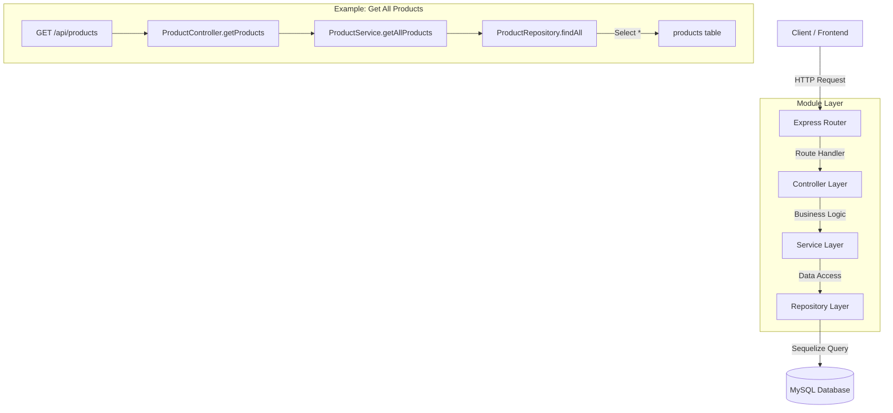
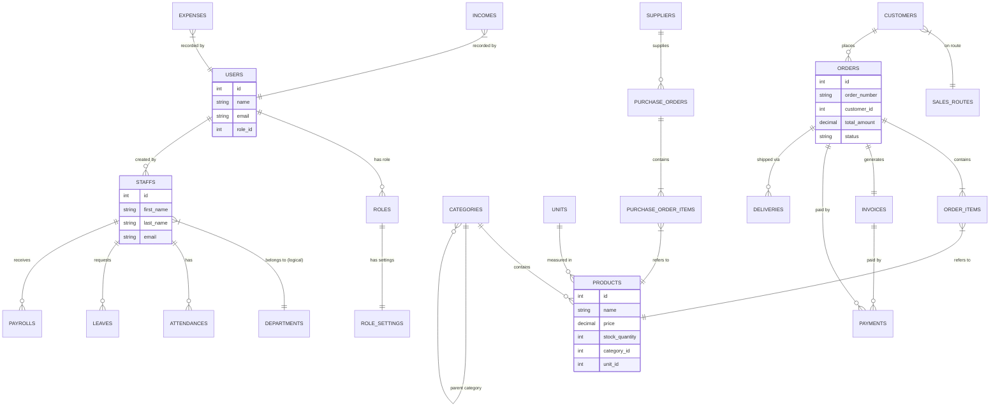
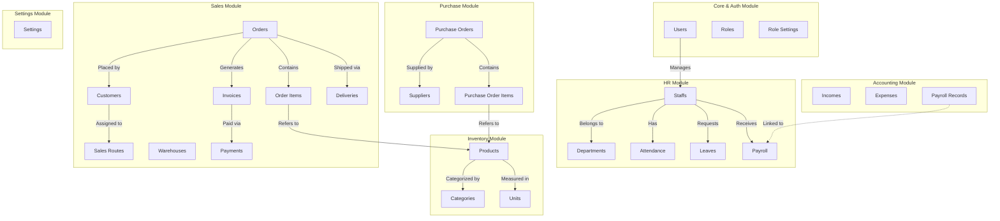

# System Architecture

## 1. API Request Flow (Route Relation)

This graph illustrates the standard flow of a request through the system layers.

## 2. Database Entity Relations (ER Diagram)

This diagram shows the relationships between the database tables.

## 3. Module-Entity Relationship Map

This graph groups database entities by their respective business modules.

